<div align="center">

<picture>
  <source media="(prefers-color-scheme: dark)" srcset="./dark.svg">
  
</picture>

<br/><br/>


<br/><br/>

<a href="mailto:aletidhanush9999@gmail.com">
  
</a>
<a href="https://github.com/DhanushAleti">
  
</a>

<br/><br/>


</div>

<br/>

## ⟡ About

```txt
const engineer = {
  role: "Software Engineer · AI/ML · Full Stack",
  focus: ["distributed systems", "LLM-powered products", "developer tooling"],
  philosophy: "ship fast, measure everything, refine relentlessly",
};
```

I'm **Dhanush**, a software engineer who moves fluidly between deep systems work and
product-facing engineering — equally comfortable designing an API contract, training and
shipping an ML pipeline, or shaping a UI end-to-end. I care about building things that are
fast, correct, and pleasant to use, and I treat AI-assisted engineering as a core part of
my workflow rather than a novelty.

**Open to:**

- Full-time Software Engineer / AI Engineer roles
- High-leverage freelance & contract engineering
- Open-source collaboration on developer tools & AI infrastructure

<br/>

## ⟡ Tech Stack

<div align="center">

**Languages**
<br/>


**Frontend**
<br/>


**Backend & Databases**
<br/>


**Cloud, DevOps & Tooling**
<br/>


</div>

<br/>

## ⟡ AI / ML Expertise

| Domain | Proficiency | Details |
|---|:---:|---|
| LLM Application Engineering | ●●●●○ | RAG pipelines, agentic workflows, prompt/context engineering, tool-use orchestration |
| Model Fine-Tuning | ●●●○○ | LoRA/QLoRA adaptation, dataset curation, evaluation harnesses |
| MLOps & Serving | ●●●○○ | Model packaging, inference APIs, monitoring, cost/latency optimization |
| Classical ML / Data Science | ●●●○○ | Feature engineering, experimentation, statistical evaluation |
| AI Product Integration | ●●●●○ | Embedding AI features into full-stack products with real UX constraints |

<br/>

## ⟡ Featured Projects

<details>
<summary><b>🚀 Project Phi</b></summary>
<br/>

Flagship active build focused on solving a high-leverage problem with AI-first product thinking and a strong engineering backbone.

<table>
<tr><td><b>Stack</b></td><td>TypeScript, Python, AI/LLM workflows, full-stack product architecture</td></tr>
<tr><td><b>Scale</b></td><td>Private flagship project in active development</td></tr>
<tr><td><b>Performance</b></td><td>Built for fast iteration, reliable execution, and product feedback loops</td></tr>
<tr><td><b>Security</b></td><td>Private codebase with controlled access and modular design</td></tr>
<tr><td><b>Impact</b></td><td>Core current focus and one of the strongest signals of product-building ability</td></tr>
<tr><td><b>Repository</b></td><td><a href="https://github.com/DhanushAleti/project-phi">DhanushAleti/project-phi</a></td></tr>
</table>

A premium project built to showcase product judgment, engineering depth, and practical AI integration across the stack.

</details>

<details>
<summary><b>🧭 Founder Copilot</b></summary>
<br/>

AI-powered second brain for founders, designed for chat and search over startup documents using RAG.

<table>
<tr><td><b>Stack</b></td><td>TypeScript, RAG, document search, AI workflow tooling</td></tr>
<tr><td><b>Scale</b></td><td>Private workspace-grade founder assistant</td></tr>
<tr><td><b>Performance</b></td><td>Optimized for fast retrieval and conversational access to knowledge</td></tr>
<tr><td><b>Security</b></td><td>Private repository with startup-document context handling</td></tr>
<tr><td><b>Impact</b></td><td>Shows strong product sense in AI-assisted knowledge management</td></tr>
<tr><td><b>Repository</b></td><td><a href="https://github.com/DhanushAleti/founder-copilot">DhanushAleti/founder-copilot</a></td></tr>
</table>

A strong example of applied AI engineering with real startup utility and workflow value.

</details>

<details>
<summary><b>🛰️ OrbitBench / orbitalmind</b></summary>
<br/>

Orbital mechanics and astrodynamics project exploring space science, trajectory reasoning, and simulation-style workflows.

<table>
<tr><td><b>Stack</b></td><td>Python, scientific computing, orbital mechanics, aerospace modeling</td></tr>
<tr><td><b>Scale</b></td><td>Research and engineering-focused space-tech project</td></tr>
<tr><td><b>Performance</b></td><td>Designed for accurate computation and repeatable analysis</td></tr>
<tr><td><b>Security</b></td><td>Local/research-oriented technical project</td></tr>
<tr><td><b>Impact</b></td><td>Highlights serious interest in aerospace and physics-based engineering</td></tr>
<tr><td><b>Repository</b></td><td><a href="https://github.com/DhanushAleti/orbitalmind">DhanushAleti/orbitalmind</a></td></tr>
</table>

An excellent differentiator — combines analytical rigor with a space-science background.

</details>

<details>
<summary><b>🛠️ Code Debugger Agent</b></summary>
<br/>

Python-based AI coding and debugging agent built to assist with analysis, diagnosis, and code improvement.

<table>
<tr><td><b>Stack</b></td><td>Python, agent workflows, debugging automation, AI tooling</td></tr>
<tr><td><b>Scale</b></td><td>Developer tooling project with practical engineering use cases</td></tr>
<tr><td><b>Performance</b></td><td>Built to reduce debugging time and improve iteration speed</td></tr>
<tr><td><b>Security</b></td><td>Scoped for controlled code analysis and assistant-driven workflows</td></tr>
<tr><td><b>Impact</b></td><td>Shows strong alignment with AI engineering and productivity tooling</td></tr>
<tr><td><b>Repository</b></td><td><a href="https://github.com/DhanushAleti/code-debugger-agent">DhanushAleti/code-debugger-agent</a></td></tr>
</table>

A solid recruiter-facing project connecting AI, software quality, and developer experience.

</details>

<details>
<summary><b>🔎 My RAG Project</b></summary>
<br/>

Retrieval-augmented generation application demonstrating practical use of embeddings, search, and context-aware AI responses.

<table>
<tr><td><b>Stack</b></td><td>Python, RAG pipeline, embeddings, document retrieval</td></tr>
<tr><td><b>Scale</b></td><td>Personal AI application / experimentation project</td></tr>
<tr><td><b>Performance</b></td><td>Built around responsive retrieval and usable answer generation</td></tr>
<tr><td><b>Security</b></td><td>Private data-source handling and isolated experimentation</td></tr>
<tr><td><b>Impact</b></td><td>Demonstrates hands-on RAG implementation experience</td></tr>
<tr><td><b>Repository</b></td><td><a href="https://github.com/DhanushAleti/my-rag-project">DhanushAleti/my-rag-project</a></td></tr>
</table>

Useful as a supporting project that reinforces AI and knowledge-system depth.

</details>

<details>
<summary><b>🌌 Exoplanet Hunter TESS</b></summary>
<br/>

Python project related to NASA TESS and exoplanet detection, aligned with aerospace and scientific computing interests.

<table>
<tr><td><b>Stack</b></td><td>Python, data analysis, astronomy/space-science workflows</td></tr>
<tr><td><b>Scale</b></td><td>Research-oriented scientific project</td></tr>
<tr><td><b>Performance</b></td><td>Focused on data processing and detection-style analysis</td></tr>
<tr><td><b>Security</b></td><td>Non-sensitive scientific workload</td></tr>
<tr><td><b>Impact</b></td><td>Excellent signal for space science, ML interest, and technical curiosity</td></tr>
<tr><td><b>Repository</b></td><td><a href="https://github.com/DhanushAleti/exoplanet-hunter-tess">DhanushAleti/exoplanet-hunter-tess</a></td></tr>
</table>

Especially valuable because it strengthens credibility in space-tech and research-adjacent work.

</details>

<details>
<summary><b>📊 Edlist Dashboard</b></summary>
<br/>

Project management dashboard built with modern web technologies and clean UI/UX structure.

<table>
<tr><td><b>Stack</b></td><td>Next.js, TypeScript, Tailwind CSS</td></tr>
<tr><td><b>Scale</b></td><td>Dashboard-style product application</td></tr>
<tr><td><b>Performance</b></td><td>Built for responsive product workflows and interactive usage</td></tr>
<tr><td><b>Security</b></td><td>Standard web app protection patterns</td></tr>
<tr><td><b>Impact</b></td><td>Shows full-stack frontend engineering and product execution</td></tr>
<tr><td><b>Repository</b></td><td><a href="https://github.com/DhanushAleti/edlist-dashboard">DhanushAleti/edlist-dashboard</a></td></tr>
</table>

A good proof of product UI execution and practical dashboard engineering.

</details>

<details>
<summary><b>🧠 GPT From Scratch</b></summary>
<br/>

Transformer and GPT-style language model implementation built from scratch in PyTorch.

<table>
<tr><td><b>Stack</b></td><td>Python, PyTorch, transformers, self-attention, tokenization</td></tr>
<tr><td><b>Scale</b></td><td>Learning and implementation project</td></tr>
<tr><td><b>Performance</b></td><td>Focused on correctness, clarity, and model understanding</td></tr>
<tr><td><b>Security</b></td><td>Local research and experimentation environment</td></tr>
<tr><td><b>Impact</b></td><td>Strong signal for deep learning fundamentals and AI curiosity</td></tr>
<tr><td><b>Repository</b></td><td><a href="https://github.com/DhanushAleti/gpt-from-scratch-dhanush">DhanushAleti/gpt-from-scratch-dhanush</a></td></tr>
</table>

Adds depth to the profile by showing an understanding of how modern LLMs work internally.

</details>

<br/>

## ⟡ Experience

**Founder / Builder · Project Phi**
<br/>
<sub>Current</sub>

Building a private flagship product with an AI-first mindset, strong product intuition, and full-stack engineering execution.

- Owned product architecture, feature scoping, and end-to-end implementation.
- Worked across product design, backend logic, and AI workflow integration.
- Focused on creating a scalable, recruiter-facing flagship project with real utility.

  

<br/>

**Builder · Founder Copilot**
<br/>
<sub>Current</sub>

Developed an AI-powered second brain for founders using RAG, enabling search and chat over startup documents.

- Designed the retrieval and document-organization workflow.
- Built around fast access to founder knowledge and startup context.
- Emphasized practical AI utility rather than demo-only behavior.

  

<br/>

**Builder · OrbitBench / orbitalmind**
<br/>
<sub>Current</sub>

Working on orbital mechanics and astrodynamics-focused projects rooted in space science and computational problem-solving.

- Explored trajectory reasoning, simulation logic, and scientific computation.
- Applied Python to space-tech and physics-informed workflows.
- Built projects that reflect a strong interest in aerospace engineering.

  

<br/>

## ⟡ Achievements

<div align="center">

| Recognition | Details |
|---|---|
| NASA/ISRO Space Science Program | Selected for a space science course/program. |
| IIT Madras Student Builder | Balancing Chemical Engineering with active software and AI project development. |
| Multi-domain Project Portfolio | Built across AI, RAG, orbital mechanics, dashboards, and developer tooling. |

</div>

<br/>


## ⟡ GitHub Analytics

<div align="center">


<br/>


</div>

<br/>

## ⟡ GitHub Trophies

<div align="center">


</div>

<br/>

## ⟡ Contribution Activity

<div align="center">


</div>

<br/>

## ⟡ Contribution Snake

<!-- Requires the github-contribution-grid-snake GitHub Action to generate these assets -->
<div align="center">

<picture>
  <source media="(prefers-color-scheme: dark)" srcset="https://raw.githubusercontent.com/DhanushAleti/DhanushAleti/output/github-contribution-grid-snake-dark.svg">
  
</picture>

</div>

<br/>

## ⟡ Current Focus

```yaml
current_focus:
  building:
    - "Project Phi — flagship AI-first product"
    - "Founder Copilot — RAG-powered second brain for founders"
  exploring:
    - "Orbital mechanics & astrodynamics (OrbitBench / orbitalmind)"
    - "Transformers from scratch, applied LLM engineering"
  open_to:
    - "Full-time Software / AI Engineer roles"
    - "Freelance & contract engineering"
    - "Open-source collaboration"
```

<br/>

## ⟡ Connect

<div align="center">

<a href="mailto:aletidhanush9999@gmail.com">
  
</a>
<a href="https://github.com/DhanushAleti">
  
</a>

</div>

<br/>

<div align="center">

<i>"Code is the closest thing we have to turning thought directly into reality."</i>

<picture>
  <source media="(prefers-color-scheme: dark)" srcset="https://capsule-render.vercel.app/api?type=waving&color=0:22D3EE,50:6366F1,100:030712&height=150&section=footer">
  
</picture>

</div>
